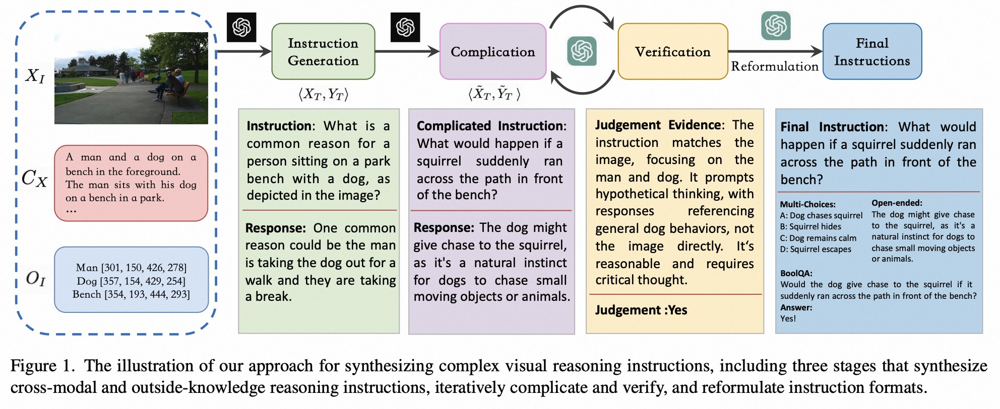

## What Makes for Good Visual Instruction? Synthesizing Complex Visual Reasoning Instruction for Visual Instruction Tuning

This repository contains the code & data for our paper [What Makes for Good Visual Instruction? Synthesizing Complex Visual Reasoning Instruction for Visual Instruction Tuning](https://arxiv.org/abs/2311.01487).

```bibtex
@misc{du2023makes,
      title={What Makes for Good Visual Instructions? Synthesizing Complex Visual Reasoning Instructions for Visual Instruction Tuning}, 
      author={Yifan Du and Hangyu Guo and Kun Zhou and Wayne Xin Zhao and Jinpeng Wang and Chuyuan Wang and Mingchen Cai and Ruihua Song and Ji-Rong Wen},
      year={2023},
      eprint={2311.01487},
      archivePrefix={arXiv},
      primaryClass={cs.CV}
}
```

## Overview

We propose *ComVint*, a visual instruction dataset, to improve the zero-shot generalization capability of Multi-modal Large Language Models (MLLMs). In this work, by conducting a comprehensive empirical study, we find that instructions focused on complex visual reasoning tasks are particularly effective in improving the performance of MLLMs on evaluation benchmarks. Building upon this finding, we design a systematic approach to automatically creating high-quality complex visual reasoning instructions. Our approach employs a synthesis-complication-reformulation paradigm, leveraging multiple stages to gradually increase the complexity of the instructions while guaranteeing quality. Based on this approach, we create the synthetic visual reasoning instruction dataset of 32K examples, namely *ComVint*.



## Update
- [11/3] We released the code and data of *ComVint*.

## ComVint Data

You can download our visual instruction data *ComVint* at [Download](https://drive.google.com/file/d/1eH5t8YoI2CGR2dTqZO0ETWpBukjcZWsd/view?usp=sharing).

## Build ComVint

1. Prepare data

If you want to build ComVint yourself with image annotations (e.g., Flickr and Visual Genome), you should first download Flickr30k Entities and Visual Genome and organize them as follows in `./data`:

```
├── ComVint
├── flickr30k_entities
│   ├── Annotations
│   ├── Convert
│   ├── Sentences
│   └── flickr30k-images
└── vg
    ├── region_descriptions.json
    ├── region_descriptions_v1.json
    └── image
```

2. Data Processing
   
Then, you can directly use the following command to process flickr dataset:

```Shell
bash process.sh
```

3. Generation Instruction
   
The code is coming soon.


## Related Projects

- [Flickr30K Entities: Collecting Region-to-Phrase Correspondences for Richer Image-to-Sentence Models](https://github.com/BryanPlummer/flickr30k_entities)
- [Visual Genome: Connecting Language and Vision Using Crowdsourced Dense Image Annotations](https://homes.cs.washington.edu/~ranjay/visualgenome/index.html)
- [Visual Instruction Tuning](https://github.com/haotian-liu/LLaVA)

